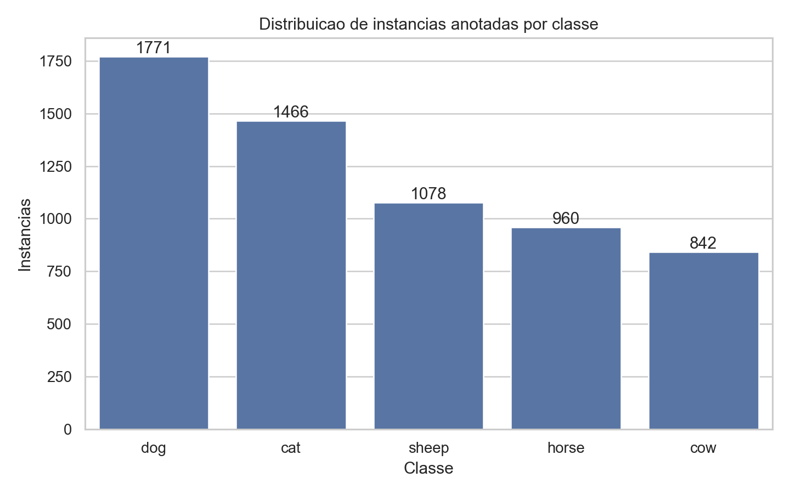
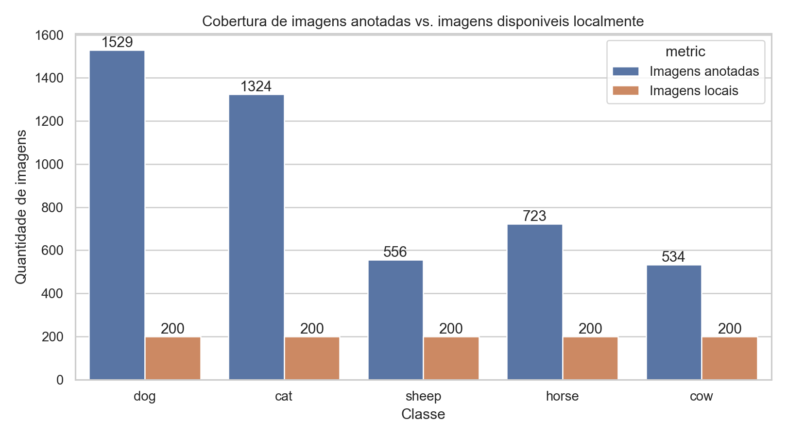
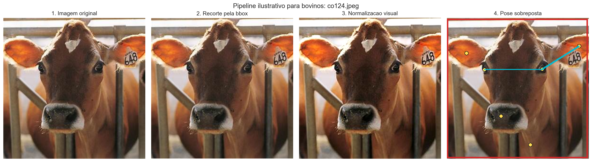
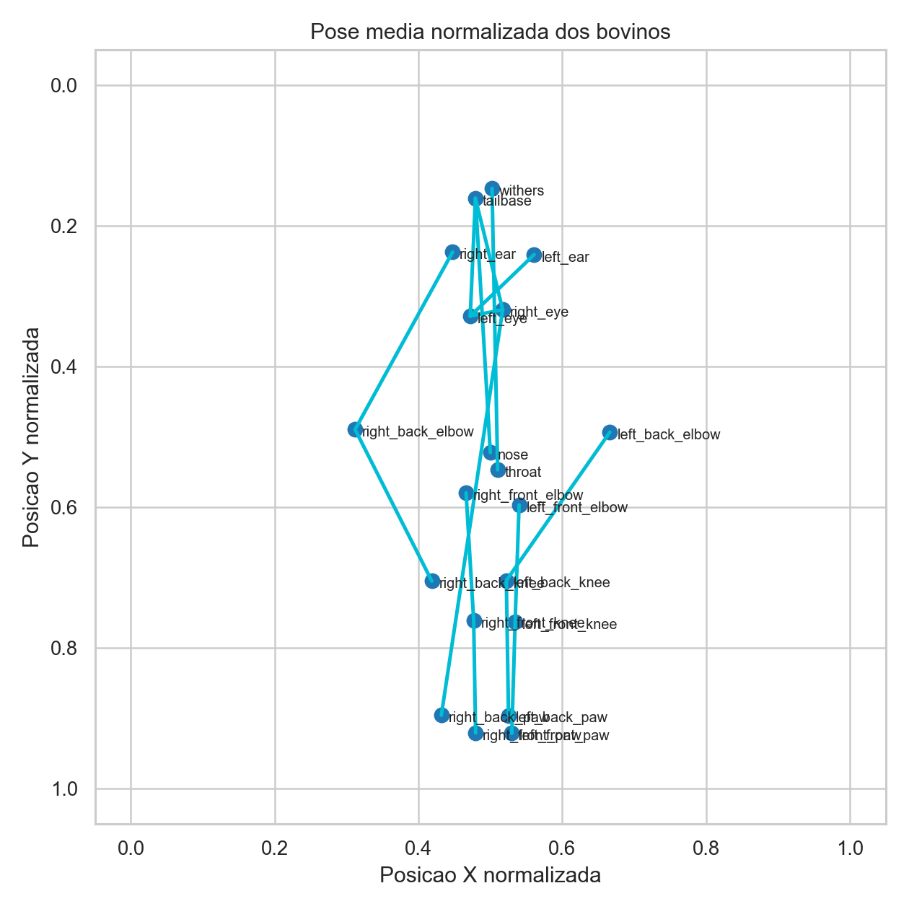
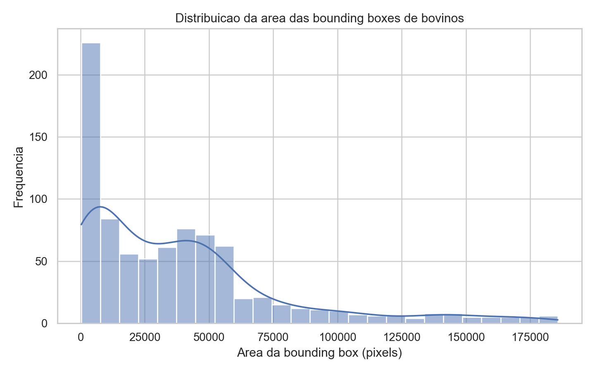

# Pose Estimation para Bovinos com Animal-Pose

Implementacao da atividade avaliativa de pose estimation para bovinos usando o [ANIMAL-POSE DATASET](https://sites.google.com/view/animal-pose/). O notebook principal da entrega esta em `output/jupyter-notebook/pose-estimation-bovinos.ipynb`, e os artefatos gerados automaticamente ficam na pasta `results/`.

## Como reproduzir

1. Baixe o dataset a partir da pagina oficial.
2. Coloque `keypoints.json` e a pasta de imagens dentro de `data/`.
3. Execute:

```bash
python scripts/generate_bovine_pose_artifacts.py
```

4. Abra o notebook `output/jupyter-notebook/pose-estimation-bovinos.ipynb`.

## 1. Analise exploratoria do dataset

O `keypoints.json` oficial contem **6117 instancias anotadas** distribuidas em **4608 imagens unicas**. As cinco classes anotadas sao `dog`, `cat`, `sheep`, `horse` e `cow`.

### Distribuicao de instancias por classe



Descricao textual:
- `dog` e a classe mais frequente, com 1771 instancias.
- `cow` possui **842 instancias anotadas**, o que corresponde a **13,76%** de todas as anotacoes do dataset.
- A classe `cow` aparece em **534 imagens unicas**.

### Cobertura de imagens anotadas vs. imagens disponiveis localmente



Descricao textual:
- O JSON referencia mais imagens do que as presentes no pacote local baixado do Google Drive.
- Para `cow`, existem **534 imagens unicas anotadas**, mas apenas **200 imagens locais** foram encontradas no pacote baixado.
- Isso significa uma cobertura local de aproximadamente **37,45%** das imagens de bovinos listadas no JSON.
- O mesmo padrao aparece nas demais classes, o que sugere que parte das imagens referenciadas vem do PASCAL VOC e de outras fontes externas.

### Tabela-resumo por classe

| Classe | Instancias | Imagens unicas | Imagens locais | Area media da bbox |
| --- | ---: | ---: | ---: | ---: |
| dog | 1771 | 1529 | 200 | 63771.42 |
| cat | 1466 | 1324 | 200 | 80339.13 |
| sheep | 1078 | 556 | 200 | 43625.67 |
| horse | 960 | 723 | 200 | 52556.78 |
| cow | 842 | 534 | 200 | 38440.85 |

## 2. Filtragem do dataset para bovinos e processamento de imagem

Para focar apenas nos bovinos, o pipeline filtra todas as anotacoes com `category_id == 5` (`cow`) e gera o arquivo:

- `results/processed/cow_keypoints_local.json`

Esse arquivo consolidado contem apenas as anotacoes de bovinos cujas imagens estao realmente disponiveis localmente, totalizando **200 imagens** e **200 instancias** reproduziveis no ambiente local.

### Etapas do processamento

1. Leitura do `keypoints.json`.
2. Mapeamento de `image_id -> file_name`.
3. Filtragem das anotacoes da classe `cow`.
4. Verificacao da existencia fisica da imagem no diretorio `data/`.
5. Recorte da imagem usando a bounding box anotada.
6. Redimensionamento do recorte para `256 x 256`.
7. Ajuste leve de contraste e nitidez para padronizar a visualizacao.
8. Sobreposicao de bounding box, keypoints e esqueleto para inspecao da pose.

### Figura ilustrativa do processo



### Exemplo detalhado passo a passo

Descricao textual:
- Na **imagem original**, vemos o animal no contexto completo da cena.
- No **recorte pela bounding box**, o foco passa a ser o corpo do bovino, reduzindo o fundo irrelevante.
- Na etapa de **normalizacao visual**, a imagem e redimensionada e recebe um pequeno reforco de contraste/nitidez.
- Na **pose sobreposta**, os 20 keypoints e as conexoes do esqueleto sao desenhados sobre o bovino, permitindo validar visualmente a consistencia da anotacao.

## 3. Resultados finais do processamento

Os principais resultados do subconjunto bovino estao resumidos abaixo.

### Pose media normalizada dos bovinos



Descricao textual:
- A pose media normalizada mostra uma estrutura espacial coerente entre cabeca, tronco, membros e base da cauda.
- Isso indica consistencia geometrica das anotacoes de pose dos bovinos.

### Distribuicao da area das bounding boxes de bovinos



Descricao textual:
- A distribuicao mostra variabilidade relevante de escala entre os bovinos anotados.
- Mesmo assim, a maior parte das amostras permanece numa faixa concentrada, o que ajuda a justificar uma etapa de normalizacao de tamanho no pipeline.

### Tabela-resumo dos bovinos

| Metrica | Valor |
| --- | ---: |
| Instancias anotadas de cow | 842 |
| Imagens unicas de cow | 534 |
| Imagens locais de cow | 200 |
| Proporcao de cow no dataset | 0.1376 |
| Area media da bbox de cow | 38440.85 |
| Media de keypoints visiveis de cow | 20.00 |

Resumo textual:
- O dataset completo contem **842 instancias** de bovinos.
- O subconjunto reproduzivel localmente contem **200 imagens/instancias** de bovinos.
- A classe `cow` possui a menor area media de bounding box entre as cinco classes anotadas.
- A padronizacao visual e o recorte por bbox ajudam a reduzir variacao de escala e fundo, facilitando a inspecao da pose.

## 4. Conclusoes pessoais

### Principais aprendizados

- O formato do ANIMAL-POSE e proximo do COCO, mas com algumas adaptacoes, como o campo `images` estruturado como dicionario.
- Antes de iniciar qualquer pipeline de pose estimation, vale validar a consistencia entre anotacoes e imagens realmente disponiveis.
- A filtragem por classe e a normalizacao visual simplificam bastante a analise especifica para bovinos.

### Limitacoes do trabalho

- O pacote local baixado diretamente do Google Drive nao contem todas as imagens referenciadas no `keypoints.json`.
- Para `cow`, apenas **200 das 534 imagens unicas** estavam disponiveis localmente.
- Por isso, o processamento visual completo foi feito sobre o subconjunto local reproduzivel, enquanto a analise exploratoria estatistica usou o conjunto completo de anotacoes do JSON.
- Este trabalho concentrou-se na preparacao, filtragem e analise das anotacoes de pose, nao no treinamento de uma rede neural de keypoint detection.

### Sugestoes de trabalhos futuros

- Complementar o dataset com as imagens faltantes do PASCAL VOC e demais fontes para cobrir os **534** bovinos anotados.
- Treinar um modelo de pose estimation especifico para bovinos com avaliacao quantitativa.
- Comparar diferentes estrategias de pre-processamento e augmentacao de dados.
- Criar um pipeline de inferencia para novas imagens de bovinos fora do dataset.

## Estrutura da entrega

- Notebook: `output/jupyter-notebook/pose-estimation-bovinos.ipynb`
- Script de geracao dos artefatos: `scripts/generate_bovine_pose_artifacts.py`
- Modulo de apoio: `src/bovine_pose_analysis.py`
- Figuras finais: `results/figures/`
- Tabelas finais: `results/tables/`
